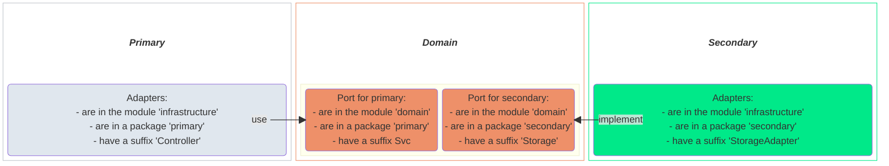

# Hexagonal architecture in IroCO₂

## Implementation

## Architectural rules

In order to ensure hexagonal architecture in IroCO₂, some tests are added:
- in domain:
  - Classes in a package secondary are interfaces
  - Classes in a package primary are interfaces
  - No adapter classes should exist
- in infrastructure:
  - and domain:
    - No classes should access to implementation services of domain (@DomainService)
    - No classes should depend on classes in functional packages
  - primary:
    - Adapters should access to primary classes of domain
    - Adapters should be in a primary package
    - And its beans
  - secondary:
    - Adapters should implement secondary interfaces of domain
    - Adapters should be annotated with @Repository
    - Adapters should be in a secondary package
    - And its entities

These rules are implemented with _archunit_.